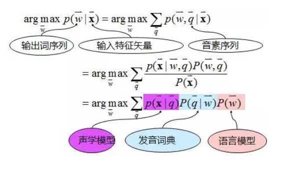
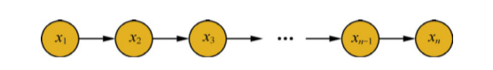
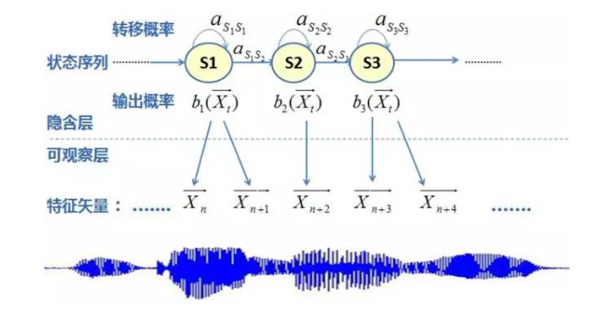
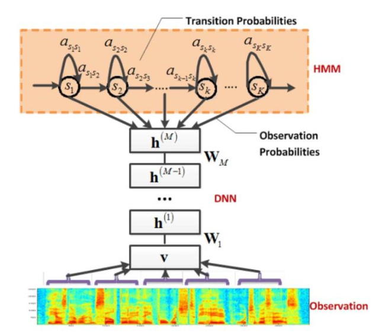
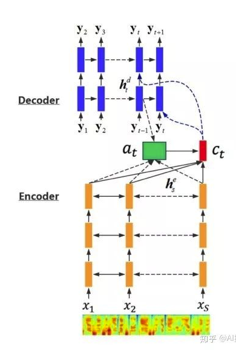
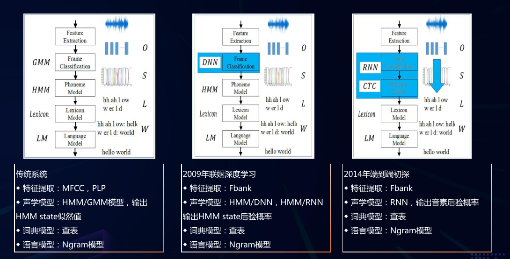
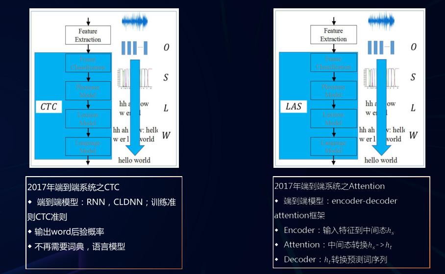

 语音识别系统的目的，是把语音转换成文字。具体来说，是输入一段语音信号，要找一个文字序列（由词或字组成），使得它与语音信号的匹配程度最高。这个匹配程度，一般是用概率表示的。**用$X$表示语音信号**，**$W$表示文字序列**，则要求解的是下面这个问题：
$$
W^{*}=\arg \max _{W} P(W | X)
$$
 一般认为，语音是由文字产生的（可以理解成人们先想好要说的词，再把它们的音发出来），所以上式中条件概率的顺序就比较别扭了。没关系，我们有贝叶斯公式，可以把条件和结论拧过来： 
$$
W^{*}=\arg \max _{W} \frac{P(X | W) P(W)}{P(X)}=\arg \max _{W} P(X | W) P(W)
$$
  第二步因为我们要优化的是 W，因而$P(X)$可以忽略

上面这个方程，就是**语音识别里最核心的公式**。可以这样形象地理解它：我们要找的 W， 需要使得 $P(W)$和$P(X | W)$ 都大。 $P(W)$ 表示一个文字序列本身的概率，也就是这一串词或字本身有多“像话”； $P(X | W)$  表示给定文字后语音信号的概率，即这句话有多大的可能发成这串音。计算这两项的值，就是**语言模型**和**声学模型**各自的任务。 

 **语言模型** language model $P(W)$

 语言模型一般利用链式法则，把一个句子的概率拆解成其中每个词的概率之积。 设W是由$w_{1}, w_{2}, \dots, w_{n}$ 组成，则$P(W)$ 可拆成下面形式：
$$
P(W)=P\left(w_{1}\right) P\left(w_{2} | w_{1}\right) P\left(w_{3} | w_{1}, w_{2}\right) \ldots P\left(w_{n} | w_{1}, w_{2}, \ldots, w_{n-1}\right)
$$
 每一项都是在已知之前所有词的条件下，当前词的概率。

不过，当条件太长的时候，概率就不好估计了，所以最常见的做法是认为每个词的概率分布只依赖于历史中最后的若干个词。这样的语言模型称为**n-gram模型**，在n-gram模型中，每个词的概率分布只依赖于前面n-1个词。  例如在bi-gram（bi-是2的前缀）模型中 $P(W)$  是拆成下面这种形式的： 
$$
P(W)=P\left(w_{1}\right) P\left(w_{2} | w_{1}\right) P\left(w_{3} | w_{2}\right) \ldots P\left(w_{n} | w_{n-1}\right)
$$

## 声学模型（acoustic model） $P(X|W)$

声学模型的任务是计算  $P(X | W)$ ， 即给定文字后，发出这段语音的概率。 声学模型是 语音识别 系统中最为重要的部分之一，它占据着语音识别大部分的计算开销，决定着语音识别系统的性能。

 

第一个问题就是：怎么才能知道每个单词应该发什么音呢？这就需要另一个模块，叫作词典，它的作用就是把单词串转换成音素串。词典一般认为是跟声学模型、语言模型并列的模块。 

 
语音识别模型
 
有了词典的帮助， 声学模型就知道给定的文字串该依次发哪些音了。不过为了计算语音跟音素串的匹配程度，还需要知道每个音素的起止时间。 这是利用动态规划来进行的，可以高效的找到音素的分界点，使得没一段语音与音素的匹配程度（用概率表示）之积最大。实际使用的算法称为 viterbi 算法，它不仅仅考虑了每一段语音和音素的匹配程度，还考虑了各个音素之间转换的概率 （ 转换概率通过HMM估计 ）

## 声学模型发展历程

## **GMM-HMM  **

 传统的语音识别系统普遍采用的是基于GMM-HMM的声学模型

其中GMM用于对语音声学特征的分布进行建模，HMM则用于对语音信号的时序性进行建模。 
> **GMM**  ：Gaussian Mixture Models 

$$
p(x)=\sum_{m=1}^{M} c_{m} N\left(x ; \mu_{m}, \sigma_{m}^{2}\right)
$$

> 一般对GMM参数的估计使用EM算法。
>
> 简单细节： https://www.cnblogs.com/yttas/p/10037272.html 

> **HMM**:  Hidden Markov Model
>
> 定义：隐马尔可夫模型是关于时序的概率模型，描述由一个隐藏的马尔可夫链随机生成的不可观测的状态随机序列，再由各个状态生成一个观测而产生观测随机序列的过程。隐藏的马尔可夫链随机生成的状态序列称为状态序列；每个状态生成一个观测，而由此产生的观测随机序列，称为观测序列。序列上的每一个位置可以看作一个时刻。

​	具体来说，马尔可夫过程是满足无后效性的随机过程。假设一个随机过程中， $t_n$时刻的状态$x_n$的条件分布，仅仅与其前一个状态$x_{n-1}$有关，即$P(x_n|x_1,x_2 \dots x_{n-1}) = P(x_n|x_{n-1})$，则将其称为马尔可夫过程，时间和状态的取值都是离散的马尔可夫过程称为马尔可夫链。

 
马尔可夫链
 
  隐马尔可夫模型是对含有未知参数（隐状态）的马尔可夫链进行建模的生成模型。在简单的马尔可夫模型中，所有状态对于观测者都是可见的，因此在马尔可夫模型中仅仅包括状态间的转移概率。而在隐马尔可夫模型中，隐状态$x_i$对于观测者而言是不可见的，观测者能观测到的只有每个隐状态的$x_i$对应的输出$y_i$，而观测状态$y_i$的概率分布仅仅取决于对应的隐状态$x_i$。即$P(y_i|x_1,y_1,x_2,y_2, \dots , x_{i+1},y_{i+1}, \dots) = P(y_i|x_{i})$。在隐马尔可夫模型中，参数包括了隐状态间的转移概率、隐状态到观测状态的输出概率、隐状态$x$的取值空间、观测状态$y$的取值空间以及初始状态的概率分布。

 
隐马尔可夫模型
 
于是HMM模型就包括了三个基本问题：

- 概率计算问题： 已知模型的所有参数，计算观测序列Y出现的概率，可使用前向和后向算法求解
- 预测问题：已知模型所有参数和观测序列Y，计算最有可能的隐状态序列X，可使用动态规划算法——维特比(viterbi )算法，没错，就是那个声学模型中强制对齐的算法。
- 学习问题：已知观测序列Y，求解使得该观测序列概率最大的模型参数，包括隐状态序列、隐状态之间的转移概率分布以及从隐状态到观测状态的概率分布，可使用Baum-Welch算法进行参数的学习。（Baum-Welch算法是EM算法的一个特例）
- 上面提到的算法实现： https://www.cnblogs.com/vpegasus/p/hmm.html 

HMM通常用来解决序列标注问题。例如可以对中文句子中的每个字做以下标注：B表示一个词开头的第一个字，E表示一个词结尾的最后一个字，M表示一个词中间的字，S表示一个单字词，则隐状态的取值空间为{B,E,M,S}。同时对隐状态的转移概率可以给出一些先验知识，B和M后面只能是M或者E，S和E猴妹只能是B或者S。而每个字就是模型中的观测状态，取值空间为语料中的所有中文字。完成建模后，使用语料进行训练可以分有监督训练和无监督训练。有监督训练即对语料进行标注，相当于根据经验得到语料的所有隐状态信息，然后就可以用简单的计数法对模型中的概率分布进行极大似然估计。无监督训练可以用上文提到的Baum-Welch算法，同时优化隐状态序列和模型对应的概率分布。

### 具体GMM-HMM建模框架：

 
HMM建模框架
 
关于这个图的理解：  https://www.zhihu.com/question/64231676 ， https://zhuanlan.zhihu.com/p/26742170 

其中，输出概率使用GMM建模，即：
$$
b_{i}(\overrightarrow{X_{t}})=p\left(\overrightarrow{X_{t}} | s_{t}=i\right)=\sum_{j=1}^{M} c_{j} * N\left(\vec{X}_{t}, \mu_{i j}, \Sigma_{i j}\right)\\
N\left(\vec{X}_{t}, \mu_{v}, \Sigma_{t j}\right)=\frac{1}{(2 \pi)^{p / 2}\left|\Sigma_{t f}\right|^{1 / 2}} \exp \left\{-\frac{1}{2}\left(\vec{X}_{t}-\mu_{v}\right) \Sigma_{i j}^{-1}\left(\vec{X}_{t}-\mu_{t j}\right)^{T}\right\}
$$

###  小结：

 HMM模型假定一个音素含有3到5个状态，同一状态的发音相对稳定，不同状态间是可以按照一定概率进行跳转；某一状态的特征分布可以用概率模型来描述，使用最广泛的模型是GMM。因此GMM-HMM 框架中，HMM 描述的是语音的短时平稳的动态性，GMM 用来描述 HMM 每一状态内部的发音特征。 

基于 GMM-HMM 框架，研究者提出各种改进方法，如结合上下文信息的动态贝叶斯方法、区分性训练方法、自适应训练方法、HMM/NN 混合模型方法等。这些方法都对语音识别研究产生了深远影响，并为下一代语音识别技术的产生做好了准备。自上世纪 90 年代语音识别声学模型的区分性训练准则和模型自适应方法被提出以后，在很长一段内语音识别的发展比较缓慢，语音识别错误率那条线一直没有明显下降。 

 GMM-HMM声学模型在一段时间内统治了语音识别领域，但任何方法都有自身的局限性，GMM-HMM也不例外，具体如下：
• **优点**：GMM训练速度快，声学模型较小，容易移植到嵌入式平台
• **缺点**：GMM没有利用帧的上下文信息，GMM不能学习深层非线性特征变换。 

##  **DNN-HMM** 

 2006年，Hinton提出深度置信网络（DBN），促使了深度神经网络（DNN）研究的复苏。2009 年，Hinton 将 DNN 应用于语音的声学建模，在 TIMIT 上获得了当时最好的结果。2011 年底，微软研究院的俞栋、邓力又把 DNN 技术应用在了大词汇量连续语音识别任务上，大大降低了语音识别错误率。从此语音识别进入DNN-HMM时代。 

DNN-HMM 架构
 	 
可以看到，GMM和DNN都是用来拟合HMM的观测序列的概率分布的。

不同点：

-  GMM 是生成模型，是可以直接生成似然概率 $P(X| W)$，这个似然概率就是 HMM 所需要的观察概率。  
-  DNN是判别式模型， HMM 的观察概率由 DNN 生成的后验概率$P(W |X)$经贝叶斯公式转换得到$P(X|W)$。 

  generative model本质上需要模拟一个物体是如何经过多个中间步骤而产生（generate）的，这导致generative model往往需要有一些额外的assumption，比如，中间步骤每一步可能有多少可能，数据可以假设成什么概率分布，等等。对于每一个类，都需要做这样的假设，而且需要知道先验分布。

  discriminative model的核心在于discriminate（区分）多个类。不用关心每个数据点是如何产生的，直接寻找多个class之间的分类界面，不需要过多的假设，不需要知道先验分布。  所以一般来说discriminative model的效果比generative model效果好，除非用discriminative model没法子直接解决问题。 

2012年，微软邓力和俞栋将前馈神经网络FFDNN（Feed Forward Deep Neural Network）引入到声学模型建模中，将FFDNN的输出层概率用于替换之前GMM-HMM中使用GMM计算的输出概率，引领了DNN-HMM混合系统的风潮。之后，很多研究者使用了RNN、LSTM、CNN-LSTM等多种网络结构对输出概率进行建模，由此产生了RNN-HMM、LSTM-HMM、CNN-HMM等诸多DNN-HMM声学模型。

上面提到的CNN-HMM构架是将语音看作图像使用CNN进行特征提取，在此基础上再利用LSTM表达语音的长时相关性。 

---

## DNN - CTC

  上面的DNN-HMM模型本质是将经典的GMM-HMM模型中的GMM用DNN取代，那么接下来想到的自然是：把HMM也给干掉。

上面提到的DNN和RNN等建模技术在模型训练时需要满足一个条件，就是训练数据中每一帧都要预先确定对应的标注，即对应DNN输出状态的序号，训练特征序列和标注特征序列必须是等长的，而为了得到标注，需要使用已有模型对训练数据序列和标注序列进行强制对齐，但是基于大数据训练时标注的准备比较耗费时间，同时对齐使用的模型精度往往存在偏差，训练中使用的标注会存在错误。

 CTC的全称是Connectionist Temporal Classification，中文翻译大概是连接时序分类。它要达到的目标就是直接将语音和相应的文字对应起来，实现时序问题的分类。  

 CTC（准则的引入，解决了标注序列与特征序列不等长的问题，通过前向后向算法自动学习语音特征中的模型边界，这种准则与用于时序建模的神经网络（如LSTM）的结合可以直接用于端到端的模型建模。

## Encoder-Decoder 框架

 基于GMM-HMM框架的语音识别系统可以认为是第一代语音识别系统，基于DNN-HMM框架的系统可以认为是第二代语音识别系统。 

 这些语音识别系统都是由声学模型和语言模型两部分组成，由于两个部分在训练时相互独立，因此在实际应用中经常会出现由两个模型的协同不好引起的识别错误。**而E-D方案最大优点是声学和语言的联合训练，训练方式更为简单，并且在大数据时代，这个优点会更加的突出。** 

encoder-decoder

 由于传统语音识别的方案采用音素状态建模的方式，中英文混合建模容易带来相互之间串扰的问题，实际使用中一般采用中文和英文分别建模的方案。 

而对于编解码识别框架，建模单元可以选用对中文的单字和英文联合建模的方式，而中文的单字和英文的单词基本上不会出现发音相近的情况，避免了传统方案中的中英文相互串扰的问题。为了减少建模单元的数量同时又保证英文单词对于罕见词的覆盖度，英文建模单元拟根据双字节编码（BPE）的方式构建英文子词。

因此，**基于注意力机制的中英文混合建模的编解码语音识别系统的建模单元采用中文的单字和英文的子词的混合建模方式。**

# 总结:

